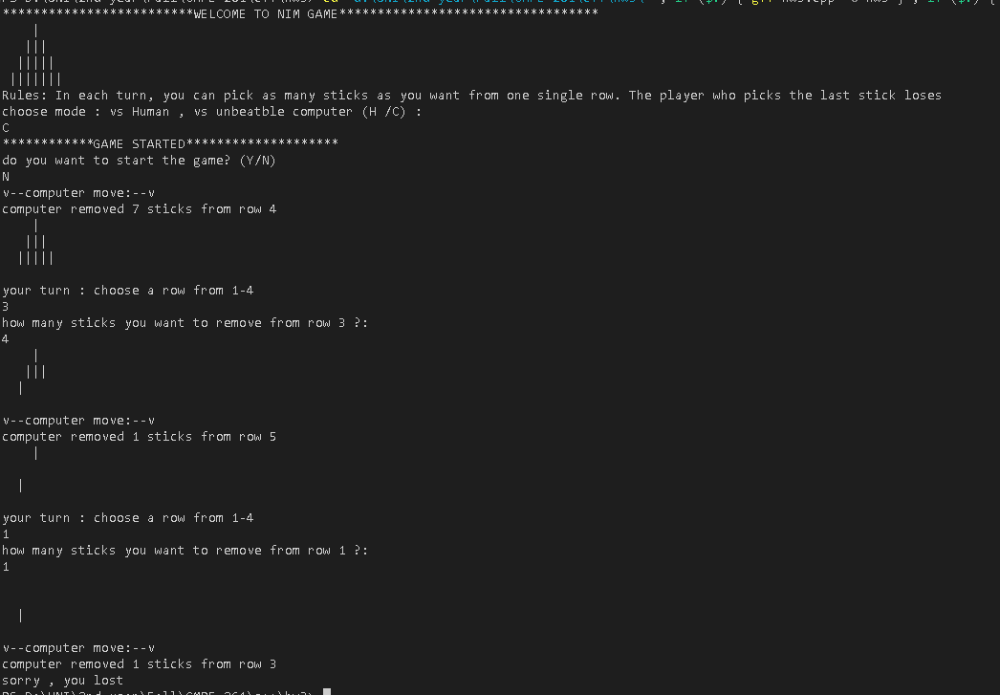

Nim is a mathematical game of strategy in which two players take turns removing (or "nimming") objects from distinct heaps or piles. On each turn, a player must remove at least one object, and may remove any number of objects provided they all come from the same heap or pile. Depending on the version being played, the goal of the game is either to avoid taking the last object or to take the last object.
I built the game with two modes, multiplayer and vs computer mode

in vs computer mode, if you start you will ALWAYS loose, i used logic to make an unbeatble computer
but if the computer starts, you might have a chance if you really know how to play!

[Watch the video](https://youtu.be/qtZL8bHFvi8)
